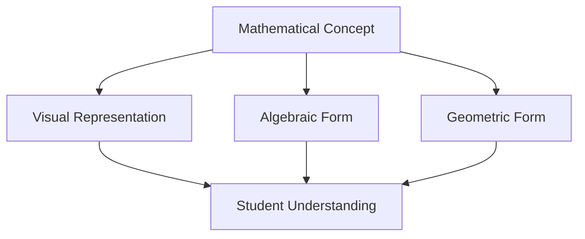

Exploring how AI can enhance mathematical learning and understanding. Through interactive visualizations and adaptive explanations, we're discovering new ways to make complex mathematical concepts more accessible and intuitive.

## The Challenge

Mathematics education often struggles with making abstract concepts tangible. Students can memorize formulas and procedures, but true understanding requires connecting concepts to intuition and real-world applications.

Consider the Pythagorean theorem:

$$
c = \sqrt{a^2 + b^2}
$$

## AI as a Learning Partner

Modern AI systems can serve as personalized tutors, adapting explanations to individual learning styles. They can:

- Generate multiple explanations for the same concept
- Create interactive visualizations on demand
- Provide step-by-step guidance with context-aware hints
- Adapt difficulty based on understanding

Here's a simple example of how we can visualize mathematical relationships:



## Our Experiments

We've been exploring how AI can assist in mathematical learning through:

1. **Interactive Explanations**: AI-generated explanations that adapt to questions
2. **Visualization Generation**: Creating diagrams and graphs to illustrate concepts
3. **Problem-Solving Guidance**: Breaking down complex problems into manageable steps

Here's some code we use for visualization:

```typescript
function calculateDistance(point1: Point, point2: Point): number {
  const dx = point2.x - point1.x;
  const dy = point2.y - point1.y;
  return Math.sqrt(dx * dx + dy * dy);
}
```

## The Future

As AI capabilities continue to improve, we see enormous potential for personalized, adaptive learning experiences that make mathematics more accessible to everyone.

## Projects

Check out our work on mathematical visualization in projects like [Numinum](#) and [katex-skia](https://github.com/midasum/katex-skia).

